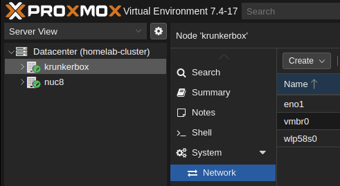

# Ansible Role : Proxmox Provisioner
Create and Configure Proxmox VM with Ansible:

This Ansible playbook streamlines the deployment of Proxmox virtual machines (VMs) with flexibility and ease. It offers the following key features:

1. VM Creation: Automates the creation of Proxmox VMs from scratch.
2. Cloud Init Setup: Configures cloud-init for customization.
3. Network Configuration: Allows you to define network settings, including DHCP or static IP assignment and custom DNS.
4. SSH Key Integration: Enables you to set up public SSH keys for secure remote access.
5. QEMU-Guest Agent: Installs the QEMU-Guest Agent for improved VM management.
6. Disk Expansion: Customize the disk size expansion to meet your needs.
7. Resource Allocation: Specify memory, CPU cores, sockets, and CPU arguments as per your requirements.
This Ansible playbook empowers you to effortlessly create and configure Proxmox VMs, tailoring them to your specific use cases while ensuring efficient resource management and network setup.


## Background
After manually creating VMs in proxmox for a while, I decided to automate the process. I found a few roles that did what I wanted, but they were either too complex or didn't do exactly what I wanted. So I decided to create my own role. Bare in mind that this is fairly specific to my use case, but I hope it can be of use to others as well.


## Role Variables
Available variables are listed below, along with default values (see [defaults/main.yml](./defaults/main.yaml)) or ([meta/argument_specs.yaml](./meta/argument_specs.yaml))


### Proxmox Node Configuration

The IP address and name of the Proxmox node is required to create a VM. These are used to connect to the Proxmox API as well as SSH into the VM to configure it.

The name can be found in the Proxmox web UI under the Datacenter view.
<details>
  <summary>Proxmox Node Name</summary>

  

  *In this example, there is two nodes: `krunkerbox` and `nuc8`.*
</details>


`vm_node_api_user` and `vm_node_api_password` are used to connect to the Proxmox API used by the Ansible module [community.general.proxmox_kvm](https://docs.ansible.com/ansible/latest/collections/community/general/proxmox_kvm_module).

```yaml
vm_node_ip: 192.168.1.1
vm_node: krunkerbox
vm_node_api_user: root@pam      # Proxmox API user
vm_node_api_password: password  # Proxmox API password
```

### VM Image Configuration
The cloud image you want to use is specified by `vm_img_url` and `vm_img_filename`. The URL is used to download the image to the Proxmox node, and the filename is used to identify the image in the Proxmox web UI.

I have personally tested this role with the following:
- [Ubuntu Server 22.04 LTS](https://cloud-images.ubuntu.com/jammy/20240117/jammy-server-cloudimg-amd64.img)

> [!NOTE]
> If the image already exists on the Proxmox node, it will not be downloaded again.

```yaml
# URL of the cloud image to download
vm_img_url: https://cloud-images.ubuntu.com/jammy/20240117/jammy-server-cloudimg-amd64.img

# Name of the image in the Proxmox web UI
vm_img_filename: jammy-server-cloudimg-amd64.img
```

### VM Identity Configuration

The VM ID and name are used to identify the VM in the Proxmox web UI. The ID must be unique, and the name must be unique per node.

```yaml
vm_id: 100
vm_name: ubuntu-vm
```


### VM Network Configuration

```yaml
# VM Network Devices defines the network devices to add to the VM as seen in Proxmox web UI > VM > Hardware > Network Device
vm_network_devices:
      # net1: 'virtio=4A:76:7A:DC:F5:89,bridge=vmbr0'                   # Normal Bridge
      # net2: 'virtio=4A:76:7A:DC:F5:89,bridge=vmbr0,firewall=1'        # Bridge with Firewall
      # net3: 'virtio=4A:76:7A:DC:F5:89,bridge=vmbr0,firewall=1,tag=10' # Bridge with Firewall and VLAN 10


# Default and how to use static IP can be found in ./defaults/main.yaml
cloudinit_ipconfig:
  ipconfig0: "ip=dhcp"


# Optional
nameservers:
  - 8.8.8.8
  - 1.1.1.1
```

### VM Hardware Configuration

```yaml
# Amount of memory in MB
vm_memory: 2048

# Number of CPU cores
vm_cores: 2

# Number of CPU sockets
vm_sockets: 1

# Whether to start the VM after creation
vm_start: true

# Optional: Arguments to pass to the CPU (I found use for it, when enabling AVX for mongodb)
cpu_args: "host,hidden=1"

# The disk size in GB (Actually the amount added to the disk size, so 20 will result in 20GB + the size of the image)
vm_disk_size: 20
```

### SSH and User Configuration
In order to be able to SSH into the VM, you must specify a public SSH key and a user to create on the VM. The user's password is also required.

```yaml
# Trusted SSH public keys to add to the VM
ssh_public_key: "ssh-rsa AAAAB3NzaC1yc2EA...."

# The user to create on the VM
default_user: ubuntu

# The user's password
default_user_password: verysecurepassword
```

# Example Playbook
```yaml
- hosts: ubuntu-servers
  gather_facts: false
  vars_files:
    - 'vars/vault.yaml'
  roles:
    - role: rasmusgodske.proxmox-provisioner
  vars:
    # ---------- VM Node ----------
    vm_node: "krunkerbox"
    vm_node_ip: "192.168.12.13"
    vm_node_api_user: "{{ vault.proxmox.root.user }}"
    vm_node_api_password: "{{ vault.proxmox.root.password }}"

    # ---------- ISO Specific Arguments ----------
    vm_img_url: "https://cloud-images.ubuntu.com/jammy/20240117/jammy-server-cloudimg-amd64.img"
    vm_img_filename: "jammy-server-cloudimg-amd64.img"

    #  ---------- VM Name / ID ----------
    vm_id: 3005
    vm_name: "ubuntu-vm"

    # ---------- Network Specific Arguments ----------
    vm_network_devices:
       net0: "virtio=00:11:22:33:44:55,bridge=vmbr0,firewall=1,tag=16" # Bridge with Firewall and VLAN 16

    nameservers:
      - 8.8.8.8
      - 1.1.1.1

    # Example of using DHCP
    cloudinit_ipconfig:
      ### Configure to use dhcp
      ipconfig0: "ip=dhcp"

    # # Example of using Static IP
    # cloudinit_ipconfig:
    #   ipconfig0: "ip=192.168.1.5/24,gw=192.168.12.1"

    #------------ Hardware Specific Arguments ----------
    vm_memory: 2048
    vm_cores: 2
    vm_sockets: 1
    vm_start: true
    vm_disk_size: 15 # 15GB + the size of the image

    # ---------- SSH / User ----------
    default_user: "{{ vault.username }}"
    default_user_password: "{{ vault.password_hash }}"
    ssh_public_key: ssh-rsa AAAAB3NzaC1...
```


# Known Issues / Limitations
- The network cloud init settings are not in use at the moment. Because I were unable to get it to work at the time of writing this. See [templates/README.md](./templates/README.md) for more information. If you have any suggestions or improvements, feel free to open an issue or a pull request. I will try to respond as quickly as possible.

# Changes
See [CHANGELOG.md](./CHANGELOG.md) for a list of changes.

# Contribution
If you have any suggestions or improvements, feel free to open an issue or a pull request. I will try to respond as quickly as possible.
